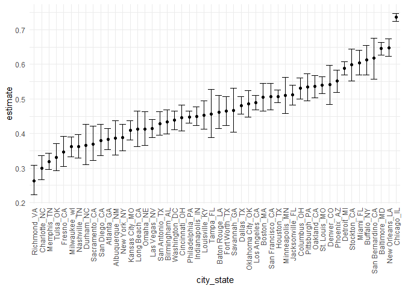
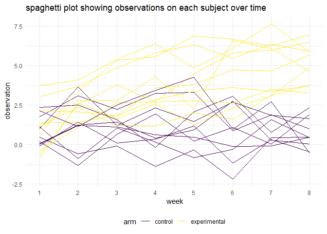
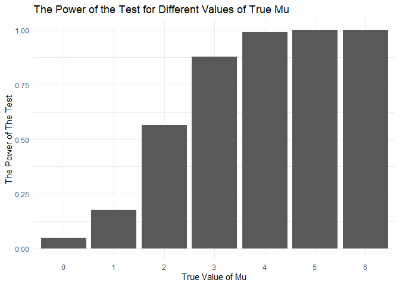
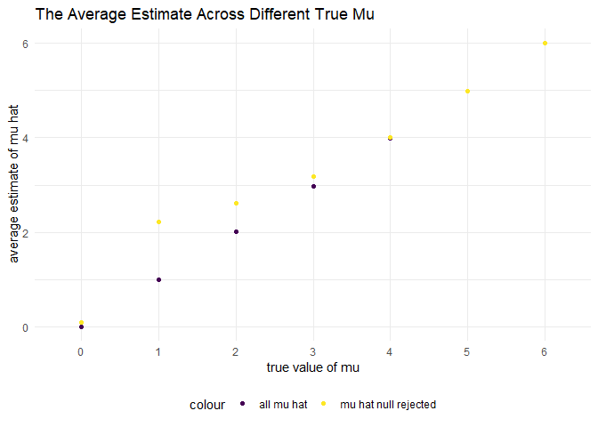

p8105\_hw5\_ps3194
================
Pangsibo Shen
11/10/2020

``` r
#initial setup
library(tidyverse)
```

    ## -- Attaching packages --------------------------------------- tidyverse 1.3.0 --

    ## v ggplot2 3.3.2     v purrr   0.3.4
    ## v tibble  3.0.3     v dplyr   1.0.2
    ## v tidyr   1.1.2     v stringr 1.4.0
    ## v readr   1.4.0     v forcats 0.5.0

    ## -- Conflicts ------------------------------------------ tidyverse_conflicts() --
    ## x dplyr::filter() masks stats::filter()
    ## x dplyr::lag()    masks stats::lag()

``` r
theme_set(theme_minimal() + theme(legend.position = "bottom"))

options(
  ggplot2.continuous.colour = "viridis",
  ggplot2.continuous.fill = "viridis"
)

scale_colour_discrete = scale_color_viridis_d
scale_fill_discrete = scale_fill_viridis_d
set.seed(123)
```

## problem 1

Read in the table

``` r
#load and clean the data
homicide_df =
  read_csv("./data/homicide-data.csv") %>%
  mutate(
    city_state = str_c(city, state, sep = "_"),
    resolved = case_when(
      disposition == "Closed without arrest" ~ "unsolved",
      disposition == "Open/No arrest" ~ "unsolved",
      disposition == "Closed by arrest" ~ "solved",
    )
  ) %>%
  select(city_state, resolved) %>%
  filter(city_state != "Tulsa_AL")
```

    ## 
    ## -- Column specification --------------------------------------------------------
    ## cols(
    ##   uid = col_character(),
    ##   reported_date = col_double(),
    ##   victim_last = col_character(),
    ##   victim_first = col_character(),
    ##   victim_race = col_character(),
    ##   victim_age = col_character(),
    ##   victim_sex = col_character(),
    ##   city = col_character(),
    ##   state = col_character(),
    ##   lat = col_double(),
    ##   lon = col_double(),
    ##   disposition = col_character()
    ## )

Raw data has 52179 observations and 12 variables including:
uid,reported\_date, victim\_last, victim\_first,
victim\_race,victim\_age, victim\_sex, city, state, lat, lon and
disposition. It contains homicides data in 50 large U.S. cities.

``` r
#summarize within cities to obtain the total number of homicides and the number of unsolved homicides
aggregate_df =
  homicide_df %>%
  group_by(city_state) %>%
  summarise(
    hom_total = n(),
    hom_unsolved = sum(resolved == "unsolved")
  )
```

    ## `summarise()` ungrouping output (override with `.groups` argument)

``` r
aggregate_df
```

    ## # A tibble: 50 x 3
    ##    city_state     hom_total hom_unsolved
    ##    <chr>              <int>        <int>
    ##  1 Albuquerque_NM       378          146
    ##  2 Atlanta_GA           973          373
    ##  3 Baltimore_MD        2827         1825
    ##  4 Baton Rouge_LA       424          196
    ##  5 Birmingham_AL        800          347
    ##  6 Boston_MA            614          310
    ##  7 Buffalo_NY           521          319
    ##  8 Charlotte_NC         687          206
    ##  9 Chicago_IL          5535         4073
    ## 10 Cincinnati_OH        694          309
    ## # ... with 40 more rows

Can I do a prop test for a single city?

``` r
prop.test(
  aggregate_df %>% filter(city_state == "Baltimore_MD") %>% pull(hom_unsolved),
  aggregate_df %>% filter(city_state == "Baltimore_MD") %>% pull(hom_total)) %>%
  broom::tidy()
```

    ## # A tibble: 1 x 8
    ##   estimate statistic  p.value parameter conf.low conf.high method    alternative
    ##      <dbl>     <dbl>    <dbl>     <int>    <dbl>     <dbl> <chr>     <chr>      
    ## 1    0.646      239. 6.46e-54         1    0.628     0.663 1-sample~ two.sided

Try to iterate…

``` r
results_df = 
  aggregate_df %>%
  mutate(
    prop_tests = map2(.x = hom_unsolved, .y = hom_total, ~prop.test(x = .x, n = .y)),
    tidy_tests = map(.x = prop_tests, ~broom::tidy(.x))
  ) %>%
  select(-prop_tests) %>%
  unnest(tidy_tests) %>%
  select(city_state, estimate, conf.low, conf.high)

head(results_df  )
```

    ## # A tibble: 6 x 4
    ##   city_state     estimate conf.low conf.high
    ##   <chr>             <dbl>    <dbl>     <dbl>
    ## 1 Albuquerque_NM    0.386    0.337     0.438
    ## 2 Atlanta_GA        0.383    0.353     0.415
    ## 3 Baltimore_MD      0.646    0.628     0.663
    ## 4 Baton Rouge_LA    0.462    0.414     0.511
    ## 5 Birmingham_AL     0.434    0.399     0.469
    ## 6 Boston_MA         0.505    0.465     0.545

``` r
results_df %>%
  mutate(city_state = fct_reorder(city_state,estimate)) %>%
  ggplot(aes(x = city_state, y = estimate)) +
  geom_point() +
  geom_errorbar(aes(ymin = conf.low, ymax = conf.high)) +
  theme(axis.text.x = element_text(angle = 90, vjust = 0.5, hjust = 1))
```

<!-- -->

-----

## problem 2

``` r
#load and tidy data
path_df = 
  tibble(
    path = list.files("data/lda_data")
  ) %>%
  mutate(
    path = str_c("data/lda_data/", path),
    data = map(.x = path, ~ read_csv(.x) )
         ) %>%
  unnest(data) %>%
  separate(path,c("arm","subject_id"),-6) %>%
  mutate(
    arm = case_when(
      arm == "data/lda_data/con_" ~ "control",
      arm == "data/lda_data/exp_" ~ "experimental"
    )
  )

path_df$subject_id = str_replace(path_df$subject_id, ".csv","")

path_df = 
  path_df %>%
  pivot_longer(
   cols = starts_with("week"),
   names_to = "week",
   names_prefix = "week_",
   values_to = "observation",
  ) %>%
  transform(
    subject_id = as_factor(as.numeric(subject_id)),
    arm = as_factor(arm),
    week = as.numeric(week)
            )
head(path_df)
```

    ##       arm subject_id week observation
    ## 1 control          1    1        0.20
    ## 2 control          1    2       -1.31
    ## 3 control          1    3        0.66
    ## 4 control          1    4        1.96
    ## 5 control          1    5        0.23
    ## 6 control          1    6        1.09

``` r
#plot
path_df %>%
  ggplot(aes(x = week, y = observation, gourp = subject_id, color = arm)) +
  geom_line() +
  scale_x_continuous(breaks = c(1,2,3,4,5,6,7,8)) +
  ggtitle("spaghetti plot showing observations on each subject over time")
```

<!-- -->

From the spaghetti plot, we notice that the observations for control
subjects across 8 weeks are pretty stable, with no significant
increasing or deceasing in observation values across time; on the other
hands, the numeric value of observations for experimental subjects are
increasing across 8 weeks.

-----

## Problem 3

``` r
#write a function for one-sample t-test with fixed n and sigma
sim_t_test = function(mu , samp_size = 30, sigma = 5) {
  sim_data = 
    tibble(
      broom::tidy(t.test(rnorm(n = samp_size, mean = mu, sd = sigma)))
    ) %>%
    select(c(estimate, p.value))
  sim_data
}
```

``` r
# Let's simulate 5000 times for mu = 0
output_0 = vector("list", length = 5000)

for (i in 1:5000) {
  
  output_0[[i]] = sim_t_test(0)
  
}

bind_rows(output_0)
```

    ## # A tibble: 5,000 x 2
    ##    estimate p.value
    ##       <dbl>   <dbl>
    ##  1   0.666    0.370
    ##  2  -0.942    0.258
    ##  3  -0.309    0.784
    ##  4   0.208    0.787
    ##  5   0.0500   0.955
    ##  6  -0.476    0.569
    ##  7   0.616    0.476
    ##  8   1.07     0.298
    ##  9   0.623    0.514
    ## 10   0.0397   0.969
    ## # ... with 4,990 more rows

``` r
#The probability that a false null hypothesis is rejected is referred to as power
power_0 = (bind_rows(output_0) %>%
  filter(
    p.value < 0.05 
  ) %>% nrow())/5000
```

The power of the test for \(\mu\) = 0 is 0.049.

``` r
#simulate other mu values 5000 times and record them in a tibble
sim_results = 
  tibble(
    mu = c(0,1,2,3,4,5,6)
  ) %>% 
  mutate(
    output_lists = map(.x = mu, ~ rerun(5000, sim_t_test(.x))),
    estimate_df = map(output_lists, bind_rows)
  ) %>% 
  select(-output_lists) %>% 
  unnest(estimate_df)

head(sim_results)
```

    ## # A tibble: 6 x 3
    ##      mu estimate p.value
    ##   <dbl>    <dbl>   <dbl>
    ## 1     0   -0.428  0.616 
    ## 2     0    1.07   0.225 
    ## 3     0    1.09   0.198 
    ## 4     0    0.156  0.839 
    ## 5     0   -1.17   0.269 
    ## 6     0    1.61   0.0941

``` r
#figure 1
sim_results_plot_1 =
  sim_results %>%
  filter(p.value < 0.05) %>%
  group_by(mu) %>%
  summarise(power = n()/5000) %>%
  transform(mu = as.factor(mu)) %>%
  ggplot(aes(mu, power)) +
  geom_bar(stat = 'identity') +
  ylab("The Power of The Test" ) +
  xlab("True Value of Mu") +
  ggtitle("The Power of the Test for Different Values of True Mu ")

sim_results_plot_1
```

<!-- --> As
the true value of mu becomes larger, the power of the test increases.
The results make sense as the true value becomes larger and departs more
from the null hypothesis, we are more likely to reject the false null
hypothesis, hence the power of the test becomes larger.

``` r
#figure 2 amd 3 overlay
sim_results_plot_2 =
  sim_results %>%
  group_by(mu) %>%
  summarise(avg_estimate = mean(estimate))  %>%
  transform(mu = as.factor(mu))

sim_results_plot_3 =
  sim_results %>%
  filter(p.value < 0.05) %>%
  group_by(mu) %>%
  summarise(avg_estimate = mean(estimate)) %>%
  transform(mu = as.factor(mu))

#figure 2

ggplot() +
  geom_point(data = sim_results_plot_2, aes(mu, avg_estimate, color = "all mu hat")) +
  geom_point(data = sim_results_plot_3, aes(mu, avg_estimate, color = "mu hat null rejected")) +
  ylab("average estimate of mu hat") +
  xlab("true value of mu") +
  ggtitle("The Average Estimate Across Different True Mu")
```

<!-- -->
The sample averages of \(\hat\mu\) across tests for which the null is
rejected are getting closer to the true values of \(\mu\) As the true
value of mu increases. Because as the true value of mu increases(our
hypothesized value is still 0), our power of the test is also
increasing. In other words, we are more likely to reject false null
hypothesis and the sample average of \(\hat\mu\) across tests for which
the null is rejected is going to be closer to the true mu.
